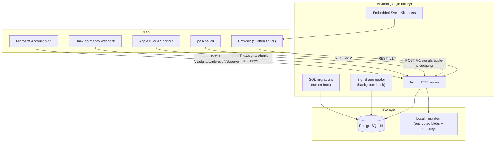
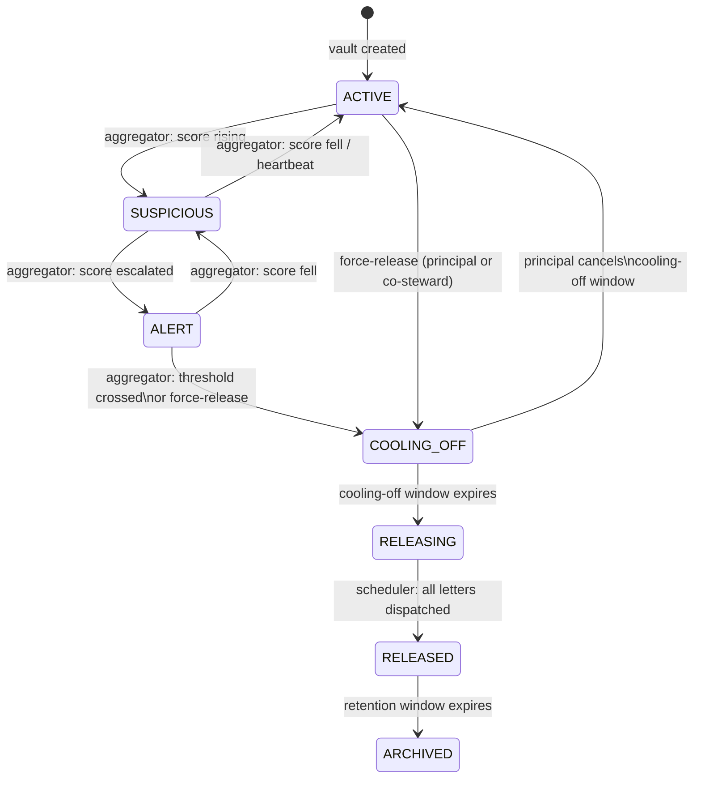
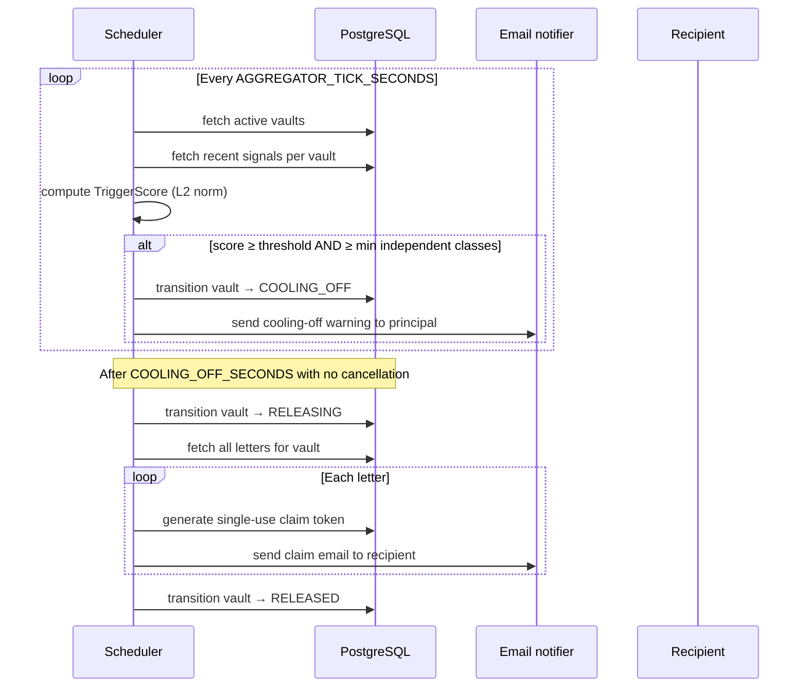
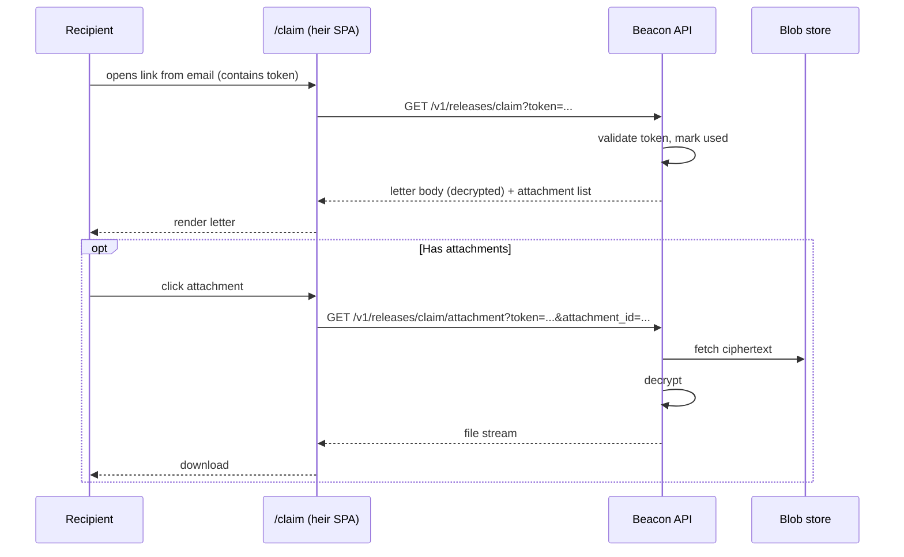
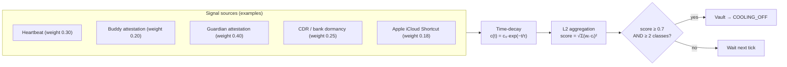

# Architecture

Paschal is a single-binary application that embeds the web UI and serves both the API and the SvelteKit frontend from one process. PostgreSQL holds all state; a local file-backed key encrypts attachment blobs.

---

## System overview



---

## Vault state machine

Vaults move through a deterministic state machine. The signal aggregator drives most transitions; the principal can manually force a release or cancel cooling-off.



---

## Release flow (signal-triggered)



---

## Claim flow (recipient)



---

## Signal scoring

The aggregator scores each vault using a weighted L2 norm across independent signal sources:

```
score = clamp(sqrt(Σ (weight_i × contribution_i)²), 0, 1)
```

`contribution_i` decays exponentially with time since the signal was observed (half-life ≈ 14 days). Observations older than 60 days are ignored.

An alert fires when:
- `score ≥ threshold` (default 0.7), **and**
- at least N independent signal classes are contributing (prevents a single source from triggering alone).



---

## Binary build

The Dockerfile uses a multi-stage build:

1. **node:22-slim** — runs `pnpm build`, producing the SvelteKit static output.
2. **cargo-chef planner** — fingerprints Rust dependencies.
3. **cargo-chef builder** — compiles the Rust binary with SvelteKit assets embedded via `include_dir!`.
4. **debian:bookworm-slim** — minimal runtime image; only the compiled binary, migrations directory, and heir claim page.

The result is a single container image (~60 MiB) with no Node runtime at all.
